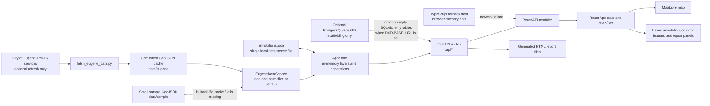
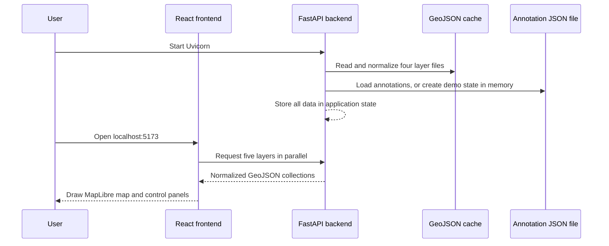
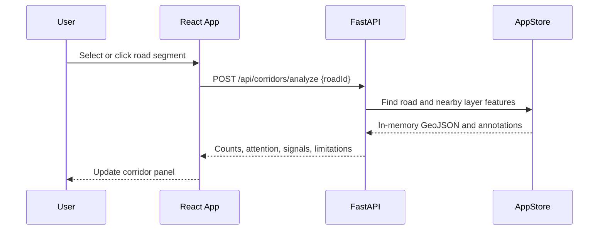
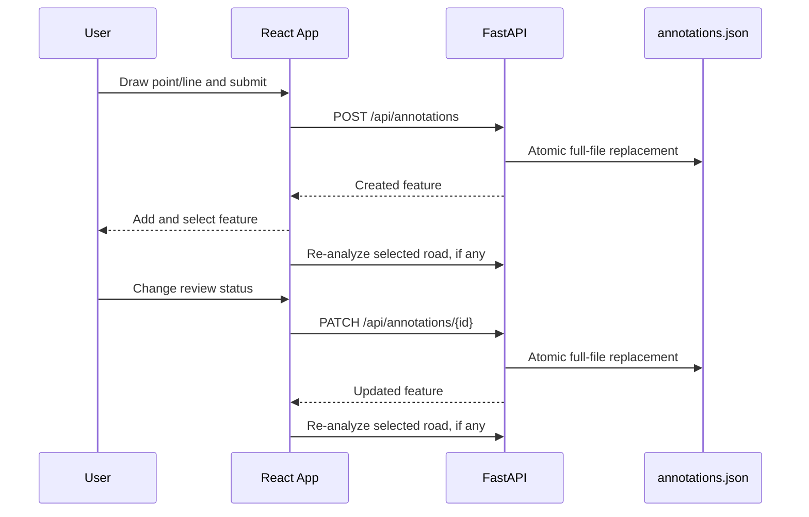
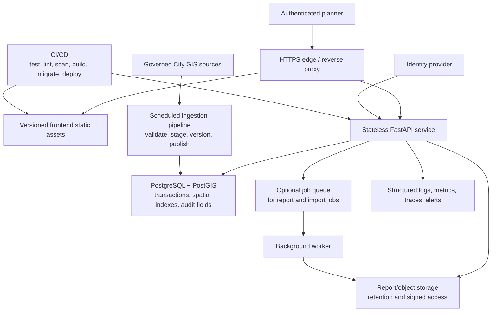

# CURBO Full Architecture and Software Review Guide

**Review date:** August 7, 2026  
**Reviewed branch:** `sprint-4-milestone`  
**Reviewed commit:** `0852584`  
**Repository:** CURBO — Sidewalk Surveying and Management Dashboard

This guide explains what CURBO does, how every major part fits together, how to run it in VS Code, what is already strong, what prevents production use, and how to improve it in a practical order. It is written for a reader who does not need to know the framework terminology in advance.

### How to use this guide

- For the shortest overview, read sections 1–4.
- To understand implementation details, read sections 5–10.
- To run the application, go directly to section 11.
- For the evidence and risk review, read sections 12–14.
- For a future architecture and action plan, read sections 15–18.
- For day-to-day prototype operation and common changes, read sections 19–20.

## 1. Executive summary

CURBO is a civic-infrastructure map and review application focused on Eugene, Oregon. A reviewer can:

- view roads, sidewalk ramps, hydrants, bicycle facilities, and reviewer notes;
- select a road segment and receive a lightweight corridor summary;
- place point or line annotations;
- move an annotation through a review status;
- see active concerns reflected in the selected corridor; and
- generate a downloadable HTML corridor report.

The current repository is a well-organized, tested **single-user prototype**. It is not yet a safe multi-user or public production system.

The simplest mental model is:

1. The backend reads four cached Eugene GeoJSON files into memory when it starts.
2. The frontend downloads those layers and draws them with MapLibre.
3. User annotations are held in backend memory and copied to one JSON file after every change.
4. Corridor analysis counts map features inside an approximate rectangle around one road segment.
5. Reports are generated as HTML files and registered in backend memory.
6. An optional PostGIS container and SQLAlchemy models exist, but the live application does not use the database for its data.

### Overall readiness

| Area | Current assessment | Plain-language meaning |
|---|---|---|
| Local development | Good | A developer can run and test it reliably. |
| Code organization | Good | Frontend, backend, data, scripts, and documentation have clear boundaries. |
| Automated tests | Good for a prototype | Important API and component behaviors are covered, but there is no full end-to-end suite. |
| Data model | Prototype only | Static GIS cache plus one local JSON file works for one process and one user. |
| Geospatial accuracy | Screening only | The analysis uses a bounding rectangle, not a true geographic corridor buffer. |
| Security | Not production-ready | There is no login, authorization, audit identity, rate limiting, or production secret design. |
| Reliability | Not production-ready | Silent browser fallback can make an unsaved change appear saved during an outage. |
| Deployment | Incomplete | The backend has a Dockerfile; the production frontend, TLS, reverse proxy, and operations stack do not. |
| Scalability | Limited | Every browser downloads all 13,520 roads and the backend scans in-memory collections. |

### The four biggest production blockers

1. **A failed write can silently become temporary browser data.** When the API cannot be reached, annotation creation can fall back to in-memory frontend data. The interface can report that the note was saved even though it will disappear after a reload.
2. **The annotation store cannot safely support concurrent users or multiple backend workers.** It uses one in-memory list, sequential counters, and one JSON file without cross-request or cross-process locking.
3. **There is no identity or permission system.** Anyone who can reach the API can create annotations, change any annotation status, and generate reports.
4. **There is no complete production delivery path.** The frontend service is commented out in Compose, and the repository has no reverse proxy, TLS, secret manager, production frontend image, deployment manifests, monitoring, or CI workflow.

## 2. Architecture at a glance



### The important boundary

The system has two different kinds of data:

- **Infrastructure data** is read-only cached GeoJSON from Eugene. It is normalized and kept in backend memory.
- **Reviewer annotations** are user-created records. They live in backend memory and are copied to a JSON file.

The PostgreSQL/PostGIS service is not part of either live path today. Configuring `DATABASE_URL` creates SQLAlchemy tables, but API reads and writes still go through `AppStore` and the JSON file.

## 3. What happens from startup to screen



The backend startup sequence is implemented in `backend/app/main.py`:

1. Load settings.
2. Create the report directory.
3. Optionally initialize SQLAlchemy if `DATABASE_URL` exists.
4. Load and normalize the cached GIS collections.
5. Load annotations from disk, or use two built-in sample annotations when the file does not exist.
6. Place the shared `AppStore` on FastAPI application state.
7. Register CORS and all `/api` routers.

The frontend startup sequence is implemented in `frontend/src/App.tsx`:

1. Start with empty layer collections so the UI can render immediately.
2. Request roads, sidewalk ramps, hydrants, annotations, and bicycle facilities in parallel.
3. Put each response into React state.
4. Pass the collections to `MapView`.
5. `MapView` updates its MapLibre GeoJSON sources and fits the map to the road network once.

## 4. Repository tour

```text
Curbo/
├── README.md                    Main project overview and local commands
├── .env.example                Example local configuration
├── docker-compose.yml          Optional PostGIS and backend containers
├── backend/                    Python API
│   ├── app/
│   │   ├── main.py             App factory, startup, middleware, router registration
│   │   ├── config.py           Environment settings and path resolution
│   │   ├── db.py               Optional SQLAlchemy engine/table initialization
│   │   ├── dependencies.py     Retrieves settings and AppStore per request
│   │   ├── routers/            HTTP endpoint definitions
│   │   ├── schemas/            Pydantic request/response validation
│   │   ├── services/           Data loading, storage, analysis, report generation
│   │   └── models/             Future SQLAlchemy table definitions
│   ├── tests/                  Backend API and service tests
│   ├── requirements.txt        Broad Python dependency ranges
│   └── Dockerfile              Backend image
├── frontend/                   Browser application
│   ├── src/
│   │   ├── main.tsx            React entry point
│   │   ├── App.tsx             Main workflow and state coordinator
│   │   ├── api/                Backend client and offline fallback behavior
│   │   ├── components/         Map and UI panels
│   │   ├── types/              TypeScript API and GeoJSON contracts
│   │   ├── utils/              Feature display and ramp-screening helpers
│   │   └── styles/             Global and responsive styling
│   ├── public/fonts/           Local MapLibre road-label glyph
│   ├── package.json            Frontend dependencies and commands
│   └── vite.config.ts          Development/build configuration
├── data/
│   ├── eugene/                 Normal runtime GIS cache
│   └── sample/                 Small backend fallback fixtures
├── scripts/                    Setup, refresh, validation, and verification tools
├── docs/                       Architecture, contracts, rationale, and review evidence
└── tests/                      Cross-project manual/integration evidence
```

### File groups and responsibilities

| Piece | Responsibility | Important note |
|---|---|---|
| `backend/app/main.py` | Creates FastAPI, performs startup work, attaches routers | This is the backend entry point used by Uvicorn. |
| `backend/app/config.py` | Reads `.env` and environment variables, resolves data paths | Settings are cached once per process. |
| `backend/app/db.py` | Builds a SQLAlchemy engine and calls `create_all` | It does not migrate or connect live routes to the database. |
| `backend/app/routers/` | Converts HTTP requests into service/store calls | Thin router design is a strength. |
| `backend/app/schemas/` | Validates annotation geometry, status, corridor input, and API output | This is the server-side contract boundary. |
| `backend/app/services/eugene_data_service.py` | Loads cached files and converts source-specific fields to stable properties | Missing primary data can fall back to samples. |
| `backend/app/services/app_store.py` | Holds runtime state, issues IDs, persists annotations, registers reports | This is the main single-user limitation. |
| `backend/app/services/spatial_queries.py` | Bounding-box filtering and corridor summary heuristic | It is intentionally approximate, not full GIS analysis. |
| `backend/app/services/report_generator.py` | Writes escaped, readable HTML reports | Report lookup remains in memory only. |
| `backend/app/models/` | Describes possible future relational tables | Geometry is currently generic JSON, not PostGIS geometry. |
| `frontend/src/App.tsx` | Coordinates all frontend state and async workflows | It also prevents stale corridor/report responses from winning races. |
| `frontend/src/components/MapView.tsx` | Owns MapLibre, sources, layers, clicks, drawing, and visibility | It receives data; it does not fetch the API itself. |
| `frontend/src/api/client.ts` | Base URL, network calls, and fallback selection | Read fallback is useful; write fallback is a data-integrity risk. |
| `frontend/src/api/fallbackData.ts` | Small browser-only demo collections and duplicate corridor logic | This must stay synchronized manually with backend rules. |
| `frontend/src/types/` | Compile-time shapes for GeoJSON and API data | TypeScript does not validate server responses at runtime. |
| `frontend/src/utils/mapHelpers.ts` | Converts raw map features into popup details and review prompts | Ramp thresholds are screening references, not compliance decisions. |
| `data/eugene/` | Committed runtime source | Roads are complete for the snapshot; other layers are 400-feature extracts. |
| `scripts/fetch_eugene_data.py` | Optional ArcGIS refresh with pagination and atomic replacement | Normal startup never requires a live City service. |
| `scripts/validate_geojson.py` | Structural and coordinate validation | It covers geometry shape, not full source semantics or provenance. |
| `scripts/verify_sprint4.sh` | Runs the existing verification set | There is no hosted CI workflow that runs it automatically. |

## 5. Major software used

### Frontend

| Software | Observed installed version | Job in CURBO |
|---|---:|---|
| React | 18.3.1 | Component rendering and UI state. |
| React DOM | 18.3.1 | Mounts the application into the web page. |
| TypeScript | 5.9.3 | Compile-time checking of props, API shapes, and GeoJSON. |
| Vite | 8.1.5 | Local development server and production bundler. |
| MapLibre GL JS | 5.24.0 | Interactive map, map layers, labels, clicks, and navigation. |
| Vitest | 4.1.10 | Frontend unit and component tests. |
| Testing Library | 16.3.2 | User-oriented React component testing. |
| jsdom | 30.0.1 | Simulated browser environment for tests. |

Vite 8 requires Node `^20.19.0` or `>=22.12.0`. The reviewed machine used Node 26.4.0 and npm 11.17.0.

### Backend

| Software | Declared range | Observed review environment | Job in CURBO |
|---|---:|---:|---|
| Python | README says 3.11+ | 3.13.7 | Backend language and data scripts. |
| FastAPI | `>=0.115,<1.0` | 0.139.0 | HTTP API, routing, OpenAPI documentation, dependency injection. |
| Uvicorn | `>=0.30,<1.0` | 0.50.0 | Local and container ASGI server. |
| Pydantic | Transitive | 2.13.4 | Request/response and settings validation. |
| pydantic-settings | `>=2.4,<3.0` | 2.14.2 | Environment and `.env` loading. |
| SQLAlchemy | `>=2.0,<3.0` | 2.0.51 | Optional future database table scaffolding. |
| psycopg2-binary | `>=2.9,<3.0` | 2.9.12 | PostgreSQL driver when a database URL is configured. |
| pytest | `>=8.0,<9.0` | 8.4.2 | Backend tests. |
| httpx2 | `>=2.0,<3.0` | Not installed in the active review interpreter | Intended TestClient transport in a fresh dependency install. |

The Python requirements are ranges, not a lock file. A dry-run on the review date would select newer versions than the passing environment, including FastAPI 0.141.1 and `httpx2` 2.9.1. That means a fresh setup is allowed to produce a dependency combination that the committed test result did not exercise.

### Data and infrastructure

| Software or format | Job in CURBO |
|---|---|
| GeoJSON | Storage and API exchange format for map features. |
| ArcGIS REST FeatureServer | Source used only when refreshing the local cache. |
| PostgreSQL 16 + PostGIS 3.4 | Optional Compose service and planned long-term spatial database. |
| Docker / Docker Compose | Backend packaging and optional local database startup. |
| HTML | Current generated corridor report format. |
| Local PBF font range | Keeps MapLibre road labels available without a font service. |

## 6. Backend architecture in detail

### 6.1 Application creation and lifecycle

`create_app()` in `backend/app/main.py` is an application factory. Tests can pass custom settings, while Uvicorn uses the module-level `app` object.

The lifespan handler performs all initialization before the first request. This makes startup deterministic: if a cached layer has an invalid root type or the annotation file is corrupt, startup fails instead of silently replacing user data.

Database failure is treated differently. If `DATABASE_URL` is set and database setup fails, the server still starts and records a text status such as `database-unavailable (...)`. The health endpoint does not expose that state, so an operator can receive `status: ok` while the configured database is unavailable.

### 6.2 Configuration

Settings use the following precedence:

1. process environment variables;
2. repository-root `.env` when the backend is launched from `backend/`;
3. a backend-local `.env`;
4. code defaults.

Key configuration:

| Variable | Default or example | Used by | Notes |
|---|---|---|---|
| `VITE_API_BASE_URL` | `http://localhost:8000` | Frontend | Base URL for all API calls. |
| `VITE_USE_MOCK_API` | `false` | Frontend | `true` bypasses the backend and uses browser fallback data. |
| `ANNOTATION_FILE` | `data/annotations.json` | Backend | Relative paths resolve below `backend/`. |
| `REPORT_DIR` | `generated_reports` | Backend | Not present in `.env.example`, but supported and documented in the backend README. |
| `DATABASE_URL` | unset | Backend | Unset means database support is disabled. |
| `BACKEND_PORT` | `8000` | Compose host mapping/settings | The Docker command itself is fixed to container port 8000. |
| `FRONTEND_PORT` | `5173` | Currently unused Compose placeholder | The frontend Compose service is commented out. |
| `POSTGRES_DB` | `curbo` | Compose/Postgres | Used for the optional database container. |
| `POSTGRES_USER` | `curbo_user` | Compose/Postgres | Development default only. |
| `POSTGRES_PASSWORD` | `curbo_password` | Compose/Postgres | Insecure for any shared environment. |
| `MAP_DEFAULT_LAT/LNG/ZOOM` | Eugene values | Not consumed by current frontend | The map defaults are hard-coded in `MapView.tsx`. |

`cors_origins` is configurable in backend settings but is not listed in `.env.example`. Production should use an explicit trusted frontend origin and should not treat local development defaults as a deployment policy.

The backend settings object also parses `POSTGRES_*` values, but `db.py` does not assemble a connection string from them. The application database path is enabled only by an explicit `DATABASE_URL`.

### 6.3 GIS data loading and normalization

`EugeneDataService` checks each layer independently:

1. use `data/eugene/<layer>.geojson`;
2. if missing and a sample exists, use `data/sample/...`;
3. otherwise return an empty collection with `status: unavailable`.

It drops features whose geometry is null or whose properties are not an object. Then it converts inconsistent City field names into a stable CURBO contract.

Examples:

- road identifiers become `road_<source id>`;
- road names can come from `name`, `AIRSNAME`, or `NAME`;
- sidewalk ramp widths, grades, and cross slopes preserve aggregate and left/right values;
- nonpositive width sentinel values become null;
- valid zero-percent slopes remain valid measurements;
- hydrants and bicycle facilities receive namespaced identifiers.

This normalization boundary is a good design choice: the rest of the application does not need to understand every source-system field name.

### 6.4 In-memory store and annotation persistence

`AppStore` contains:

- the four normalized infrastructure collections;
- a list of annotations;
- a list of current-process reports;
- sequential annotation/report counters; and
- the annotation file location.

Annotation persistence uses a sound single-file pattern:

1. serialize all annotations to a temporary file;
2. replace the real file atomically.

That protects against a partially written file if one process stops mid-write. It does **not** solve concurrent writes. Two requests or two worker processes can calculate the same next ID or replace each other's file contents.

If the annotation file is missing, the store starts with two built-in sample notes that look like planner data. They remain only in memory until the first write, at which point the samples are persisted alongside the new change. Production must replace this behavior with an explicit demo-data flag.

If the file exists but is invalid, startup raises an error and preserves it. This is safer than silently deleting planner work.

### 6.5 Request and response schemas

Pydantic schemas enforce:

- annotation types;
- nonempty descriptions up to 2,000 characters;
- point and line geometries;
- finite longitude and latitude within valid world ranges;
- at least two LineString positions;
- four supported annotation statuses;
- road ID length;
- corridor buffer range from 0 to 500 meters; and
- stable response shapes.

The API accepts selected camelCase and snake_case aliases, which keeps the JavaScript client simple while allowing readable command-line examples.

One gap is report format: the request accepts any string even though only HTML exists. It should be a literal/enum and reject unsupported values.

### 6.6 Spatial analysis

The backend supports optional layer filtering by `bbox=minLng,minLat,maxLng,maxLat`. It includes:

- point containment;
- LineString segment/rectangle intersection using Liang–Barsky clipping; and
- MultiLineString handling.

Corridor analysis performs these steps:

1. linearly find one road feature by `road_id`;
2. create an axis-aligned rectangle around the full road geometry and expand it by the requested meters;
3. count sidewalk ramps, hydrants, bicycle facilities, and annotations that intersect that rectangle;
4. retain all nearby annotations in the historical total;
5. exclude `rejected` annotations from active concern counts;
6. calculate missing-curb-cut, bicycle-gap, intersection, parking/loading, and pending-review counts;
7. calculate a preliminary bicycle-feasibility label;
8. calculate an explainable Low/Medium/High review-attention label; and
9. return human-readable signals, notes, and a limitation statement.

The review-attention heuristic is documented and capped so repeated notes cannot increase a category without limit. That explainability is a strength.

The geometric limitation is material: a large rectangle around a diagonal, curved, or multipart road can include assets that are not actually close to the road. A production GIS path should use PostGIS geometry and distance/buffer operations such as an indexed `ST_DWithin`, using an appropriate projected coordinate system.

The selected “corridor” is also one source road feature/segment, not necessarily an entire named street or planning corridor. Product language should distinguish a segment from a corridor until aggregation rules exist.

### 6.7 Reports

Report generation is synchronous:

1. rerun corridor analysis with a fixed 30-meter buffer;
2. generate an ID;
3. write an escaped, self-contained HTML file;
4. register its file path in the in-memory report list; and
5. return a download URL.

Dynamic values are HTML-escaped, which is an important security strength.

Current limitations:

- the response says “queued” even though generation already finished;
- the requested format is ignored;
- report metadata is lost at restart;
- old files remain but cannot be downloaded through the API after restart;
- the report counter resets, so a new process can overwrite an existing `rep_001.html` in a persistent volume;
- there is no retention policy, quota, or cleanup; and
- any caller can generate unlimited reports.

### 6.8 Optional database scaffolding

The repository includes SQLAlchemy models for roads, curb ramps, hydrants, annotations, and reports. On startup, `Base.metadata.create_all()` creates generic tables if `DATABASE_URL` is set.

This should not be mistaken for a completed database implementation:

- routes do not open database sessions;
- no data is imported into the tables;
- annotations still use the JSON store;
- report records still use memory;
- geometry is stored as generic JSON rather than spatial columns;
- there are no GiST spatial indexes;
- there is no migration tool such as Alembic;
- bicycle facilities do not have a SQLAlchemy model; and
- no backup or restore procedure exists.

## 7. Frontend architecture in detail

### 7.1 Entry point and application coordinator

`frontend/src/main.tsx` mounts React in `StrictMode`, imports the application styles, and imports MapLibre's CSS.

`frontend/src/App.tsx` is the main coordinator. It owns:

- all five layer collections;
- layer visibility;
- selected feature and selected road;
- corridor and report results;
- annotation drawing state;
- loading flags and the user-facing activity message; and
- request counters used to ignore stale async results.

The request-counter design is good. If a user changes corridors quickly, an old response cannot overwrite the newer selection. Annotation changes also invalidate an old report link because reports are immutable snapshots.

As the application grows, `App.tsx` will become difficult to maintain. Domain hooks or a query/state library should eventually separate layer loading, annotation mutation, corridor selection, and report generation.

### 7.2 API client and offline behavior

`fetchJsonWithFallback` has three paths:

- forced mock mode returns local data;
- a successful HTTP response returns server JSON;
- a network-level `TypeError` returns local fallback data;
- a server 4xx/5xx error is shown as an error instead of being hidden.

That distinction is thoughtful for read-only layers. A network outage can still show a compact demonstration map.

It is unsafe for writes. The same fallback behavior is used for annotation creation and status updates:

- a new annotation can be added only to module-level browser memory;
- the application then says it was saved;
- a reload loses the change;
- a status update for a server-loaded annotation may fail because the browser fallback collection may not contain it.

Production behavior should be:

- allow clearly labeled cached/demo reads if desired;
- never call a remote write “saved” until the server confirms durable storage;
- show an explicit offline/unsynced state;
- either block writes offline or implement a real durable outbox with retry, conflict handling, and a visible synchronization state.

### 7.3 Map rendering

`MapView` owns the MapLibre instance and creates:

- a plain background style;
- road lines and road-name symbols;
- bicycle-facility lines;
- sidewalk-ramp and hydrant points;
- point and line annotation layers;
- temporary point/line drawing layers; and
- navigation controls and click/hover interactions.

The map has no street basemap tiles. The road inventory itself provides geographic context. That makes the demonstration self-contained, but a production planner may need parcels, addresses, aerial imagery, boundaries, or a governed basemap.

The local PBF glyph file allows `Open Sans Semibold` road labels to render offline. A source comment still refers to a public glyph CDN even though the style uses `/fonts/...`; that comment should be corrected.

### 7.4 Feature selection and review controls

Map clicks are normalized by `mapHelpers.ts` into one `SelectedFeatureDetails` shape. The popup can then display each layer without knowing its raw field names.

For ramps, helpers:

- format available dimensions with units;
- omit missing/nonpositive width values;
- compare values with documented screening references; and
- always show that the result is not a compliance determination.

Annotations expose a status selector. A successful update changes local map state and refreshes the selected corridor.

There is no enforced state-transition model. For example, a user can jump directly from `pending` to `confirmed`, or from `rejected` back to `pending`. If that is intentional, document it. If not, enforce allowed transitions on the backend rather than only in the interface.

### 7.5 Corridor and report panels

The corridor selector renders every road feature as an HTML `<option>`. The cache has 13,520 road segments, so the control is large, includes repeated street names, and does not scale well. A searchable, virtualized street/segment picker or server-backed search would improve both usability and browser cost.

The report panel clearly presents:

- review attention;
- preliminary bicycle feasibility;
- nine evidence counts;
- contributing review signals;
- planning notes; and
- the data-limitation statement.

This is good explainable-product design. However, the term “bicycle feasibility” is stronger than the available data supports because speed, volume, width, parking, exposure, and right-of-way data are absent. Consider renaming or removing it until the product has governed inputs and a validated method.

### 7.6 Type safety

The TypeScript types closely mirror backend responses. They catch many developer mistakes during compilation.

The API client casts parsed JSON to those types. It does not validate data at runtime. If the backend or fallback shape drifts, the browser can accept invalid data and fail later. Production options include:

- generate TypeScript clients/types from FastAPI's OpenAPI document; and
- validate high-value responses with a runtime schema.

The corridor algorithm and review signal wording also exist twice: once in Python and once in `fallbackData.ts`. This duplication is already tested, but it remains a long-term drift risk.

## 8. Data model and data quality

### Current cached data

| File | Features | Approximate file size | Completeness stated by repository |
|---|---:|---:|---|
| `roads.geojson` | 13,520 | 17.3 MB | Complete service snapshot captured July 27, 2026. |
| `sidewalk_ramps.geojson` | 400 | 1.0 MB | Bounded demonstration extract. |
| `hydrants.geojson` | 400 | 0.24 MB | Bounded demonstration extract. |
| `bike_lanes.geojson` | 400 | 0.73 MB | Bounded demonstration extract. |

All seven cached and sample GeoJSON files passed the repository validator during this review.

### Annotation record

An annotation contains:

- ID;
- annotation type;
- description;
- Point or LineString geometry;
- status: `pending`, `reviewed`, `confirmed`, or `rejected`;
- source; and
- creation timestamp.

Missing production fields include:

- creator user ID;
- current reviewer user ID;
- created/updated timestamps for every change;
- a status-change history;
- tenant/organization ownership;
- source device or import batch;
- revision/version for conflict detection;
- deletion/archive state; and
- data sensitivity/visibility.

### Provenance gaps

Layer metadata says that data came from a City of Eugene GIS cache, but the API does not include a capture timestamp, source URL/version, checksum, license, refresh result, or bounded-extract extent. The UI currently displays feature counts, not the layer metadata/freshness, despite comments suggesting metadata is used by the layer panel.

Before planners rely on the data, every layer should have a catalog record with:

- authoritative source and owner;
- permitted use/license;
- captured-at and source-updated-at timestamps;
- geographic and field completeness;
- transformation version;
- quality checks and known omissions; and
- refresh and rollback history.

## 9. API reference

All live routes are under `/api`.

| Method and path | Purpose | Storage/read path | Important behavior |
|---|---|---|---|
| `GET /api/health` | Liveness response | Settings only | Does not check cache, annotation writes, reports, or database readiness. |
| `GET /api/layers/roads` | Roads GeoJSON | In-memory cache | Optional `bbox`; full response is large. |
| `GET /api/layers/sidewalk-ramps` | Ramp GeoJSON | In-memory cache | Canonical route. |
| `GET /api/layers/curb-ramps` | Ramp GeoJSON | In-memory cache | Compatibility alias. |
| `GET /api/layers/hydrants` | Hydrant GeoJSON | In-memory cache | Optional `bbox`. |
| `GET /api/layers/bike-lanes` | Bicycle facilities | In-memory cache | Optional `bbox`. |
| `GET /api/layers/annotations` | Annotation map layer | In-memory annotations | Optional `bbox`; overlaps with `/api/annotations`. |
| `GET /api/annotations` | All annotations | In-memory annotations | Same feature format used by frontend state. |
| `POST /api/annotations` | Create annotation | Memory, then JSON file | Returns HTTP 201 and the new GeoJSON feature. |
| `PATCH /api/annotations/{id}` | Change status | Memory, then JSON file | Only status is mutable; any supported status can follow any other. |
| `POST /api/corridors/analyze` | Calculate corridor evidence | All in-memory layers | Defaults to 30-meter approximate rectangle; accepts 0–500. |
| `POST /api/reports/corridor` | Generate HTML report | Memory plus report file | Always uses a 30-meter analysis, regardless of a prior custom analysis. |
| `GET /api/reports/{id}/download` | Download current-process report | In-memory report registry plus file | Old files cannot be found after restart. |

FastAPI also exposes interactive OpenAPI documentation at `http://localhost:8000/docs` when running locally.

## 10. Important user workflows

### 10.1 Select and analyze a road



### 10.2 Create or review an annotation



### 10.3 Generate a report

The backend does not reuse the summary currently shown in the browser. It recalculates the selected road using a fixed 30-meter buffer so the HTML contains the latest backend annotation state. This is the right choice for freshness, but it means a report can differ from a summary produced with a future custom buffer unless the report request also carries the analysis parameters.

## 11. Start CURBO in VS Code

### Prerequisites

Install:

- VS Code;
- Python 3.11 or newer;
- Node 20.19 or newer, or Node 22.12 or newer;
- npm;
- Git; and
- optionally Docker Desktop if you want to inspect the database scaffold or backend container.

Useful VS Code extensions:

- Python by Microsoft;
- Pylance;
- ESLint only after an ESLint configuration is added; and
- Docker, if you use Compose.

The project does not currently include `.vscode` tasks, a workspace file, or shared editor settings.

### Step 1: Open the correct folder

In VS Code, choose **File → Open Folder** and open:

```text
/Users/rydergilman/Desktop/SSM/Curbo
```

Open the `Curbo` folder itself, not its parent `SSM`. That keeps terminal paths, Python discovery, searches, and environment-file behavior consistent with the repository documentation.

### Step 2: Create local configuration if needed

In the VS Code terminal, from the repository root:

```bash
cp .env.example .env
```

Only do this when `.env` does not already exist. The file is ignored by Git. The default prototype does not need a database, so leave `DATABASE_URL` unset/commented.

### Step 3: Set up and start the backend

Open a VS Code terminal and run:

```bash
cd backend
python3 -m venv .venv
source .venv/bin/activate
python -m pip install -r requirements.txt
python -m uvicorn app.main:app --reload --port 8000
```

Then tell VS Code to use that environment:

1. open the Command Palette;
2. choose **Python: Select Interpreter**; and
3. select `backend/.venv/bin/python`.

Backend checks:

- health: `http://localhost:8000/api/health`
- interactive API docs: `http://localhost:8000/docs`

Leave this terminal running.

### Step 4: Start the frontend

Use **Terminal → Split Terminal** or open a second terminal:

```bash
cd frontend
npm ci
npm run dev
```

`npm ci` is preferred when `package-lock.json` is present because it installs the locked dependency tree. Use `npm install` only when intentionally updating dependencies.

Open:

```text
http://localhost:5173
```

### Step 5: Confirm the connected application

You should see:

- an activity message that the Eugene layers loaded;
- roads and labels across Eugene;
- layer counts including 13,520 roads;
- a corridor selector;
- annotation drawing controls; and
- the report panel.

Open the browser developer console if the interface shows fallback data. A backend network failure is logged as `CURBO API unavailable ... using local fallback`.

### Step 6: Stop the application

Press `Ctrl+C` in the frontend terminal and the backend terminal. Deactivating the Python environment is optional:

```bash
deactivate
```

### Frontend-only demo mode

Set the following in the repository-root `.env`:

```env
VITE_USE_MOCK_API=true
```

Restart Vite after changing environment variables. This mode is for UI demonstrations only. Its annotations exist only in the current browser page's memory.

### Optional PostGIS scaffold

The application does not need PostGIS. To start it for database-development work:

```bash
docker compose --profile database up -d postgres
```

Do not enable `DATABASE_URL` expecting production persistence. The current routes will continue to use `AppStore` and the JSON file.

When the backend runs on your Mac, a database URL can use `localhost`. When both backend and PostgreSQL run in Compose, the host must be the Compose service name `postgres`, not `localhost`.

### Run the complete existing verification set

From the repository root:

```bash
./scripts/verify_sprint4.sh
```

Or run individual checks:

```bash
(cd backend && python -m pytest -q)
(cd frontend && npm test)
(cd frontend && npm run build)
(cd frontend && npm audit)
python3 scripts/validate_geojson.py
docker compose config
```

### Common startup problems

| Symptom | Likely cause | Fix |
|---|---|---|
| `uvicorn` or a Python package is missing | Virtual environment is inactive or not installed | Activate `backend/.venv` and install requirements. |
| `No module named app` | Backend was launched from the wrong directory | Run Uvicorn from `backend/`. |
| Vite rejects the Node version | Node does not satisfy Vite 8's engine range | Use Node 20.19+, 22.12+, or newer. |
| Port 8000 or 5173 is in use | Another process is already listening | Stop it or intentionally change both the server and matching configuration. |
| Map shows only small sample data | Backend is unavailable or a cached layer is missing | Check `/api/health`, terminal errors, and browser console warnings. |
| Annotation appears saved but vanishes after reload | The frontend used write fallback during a network outage | Treat the change as unsaved; restore the backend and create it again. This needs a product fix. |
| Backend refuses to start because annotations are invalid | `backend/data/annotations.json` is malformed | Preserve a copy, inspect/repair the JSON, and do not delete it until user data is recovered. |
| Report returns 404 after backend restart | Report registry was in memory | The HTML may still exist on disk, but the current API no longer knows its ID. |
| Database is “connected” but app data is not in it | Database path is scaffolding only | Implement repository/service persistence before relying on PostGIS. |

## 12. Verification performed for this review

The following checks were rerun from the reviewed commit:

| Check | Result |
|---|---|
| Backend tests | 27 passed; one Starlette/TestClient deprecation warning in the active environment. |
| Frontend tests | 13 passed across 7 files. |
| Frontend production build | Passed. |
| npm dependency audit | 0 known vulnerabilities. |
| GeoJSON validation | 7 of 7 files passed. |
| Docker Compose configuration | Valid. |
| Git working tree before guide creation | Clean. |

Observed local API characteristics using a test application and temporary annotation/report paths:

| Operation | Observed result |
|---|---:|
| Backend startup and cache loading | about 0.63 seconds |
| Full roads API | 13,520 features, about 7.79 MB JSON, about 0.54 seconds in-process |
| Sidewalk ramps API | 400 features, about 199 KB |
| Hydrants API | 400 features, about 96 KB |
| Bicycle facilities API | 400 features, about 295 KB |
| Production JavaScript bundle | about 1.21 MB minified, 330 KB compressed |

These are development-machine observations, not load-test results. They are still useful evidence that the next scaling limit is the all-at-once browser payload and rendering model, not current backend startup.

The build emitted a large-chunk advisory. The backend tests emitted a TestClient deprecation warning because the active interpreter used the legacy `httpx` path while `requirements.txt` now declares `httpx2`.

## 13. What the repository does well

1. **Clear separation of responsibilities.** Routers, schemas, services, store, frontend API modules, components, and types are meaningfully separated.
2. **Offline startup does not depend on City services.** Cached data makes the core demonstration repeatable.
3. **Source normalization is centralized.** Inconsistent external field names do not spread through the app.
4. **Input validation is meaningful.** Explicit point and line coordinates are finite and range-checked.
5. **Annotation file writes are atomic.** A single process is unlikely to leave a half-written JSON file.
6. **Corrupt annotation data is preserved.** Startup fails clearly rather than silently erasing it.
7. **Status-aware evidence is explainable.** Rejected notes remain historical without inflating active concerns.
8. **Safety/compliance claims are constrained.** The API, UI, and report repeat important data limitations.
9. **Generated HTML is escaped.** This reduces injection risk in report output.
10. **Stale async results are controlled.** Old corridor and report requests cannot overwrite current frontend state.
11. **Important contracts are tested on both sides.** Geometry, persistence, normalization, review effects, report readability, and UI wording have focused coverage.
12. **The working tree and runtime artifacts are separated.** `.env`, local annotations, generated HTML, virtual environments, node modules, and builds are ignored.

## 14. Findings and risks

### Release blockers for a multi-user or public deployment

#### RB-1: Silent write fallback can lose user work

**Where:** `frontend/src/api/client.ts`, `annotations.ts`, and `fallbackData.ts`  
**Impact:** A network failure can produce a browser-only annotation while the UI reports a successful save. Reloading loses the work.  
**Fix:** Disable automatic fallback for mutations. Require durable server confirmation, or build an explicit offline outbox with persisted pending state, retry, conflict handling, and visible sync status.

#### RB-2: JSON persistence is not concurrency-safe

**Where:** `backend/app/services/app_store.py`  
**Impact:** Multiple requests, workers, or instances can duplicate IDs, overwrite updates, or serve different memory state.  
**Fix:** Move annotations and reports into transactional PostgreSQL storage. Use database-generated IDs, constraints, optimistic versioning, and transactions. Run one worker only until migration is complete.

#### RB-3: No authentication, authorization, or accountable audit trail

**Where:** All write/report endpoints  
**Impact:** Any network caller can create notes, change review decisions, or consume report storage. No record says who changed a decision.  
**Fix:** Add an identity provider, organization membership, roles, record-level authorization, audit events, and `created_by`/`updated_by` fields. Decide whether public reads are allowed separately from writes.

#### RB-4: Production delivery is incomplete

**Where:** `docker-compose.yml`, `backend/Dockerfile`, repository root  
**Impact:** There is no supported full application deployment, HTTPS boundary, production configuration, or operational ownership.  
**Fix:** Add a production frontend build/container or static hosting target, reverse proxy/API routing, TLS, secret injection, health/readiness probes, deployment manifests, and rollback documentation.

### High-priority engineering risks

#### H-1: Database support appears more complete than it is

Creating empty SQLAlchemy tables and returning a connected status does not make the application database-backed. This can mislead deployers. Either remove/clearly feature-flag the scaffold or complete repositories, migrations, imports, spatial types, and live route integration.

#### H-2: Corridor geography is approximate

An expanded axis-aligned rectangle can overcount features. Replace it with authoritative geometry, a projected coordinate reference system, spatial indexes, and a true distance query. Define whether the domain unit is a source segment, named street, selected chain of segments, or project corridor.

#### H-3: Data provenance and completeness are not strong enough for operational decisions

Three infrastructure layers are limited to 400 features, while the UI presents their counts without visible coverage/freshness. Demo annotations can become persisted “planner” records. Add dataset catalog metadata, visible freshness/coverage, an explicit demo mode, and a governed refresh/publish pipeline.

#### H-4: Browser loading does not scale

Every page downloads about 7.8 MB of road JSON plus the other collections, renders 13,520 road features, and builds 13,520 `<option>` elements. The production JavaScript bundle is about 1.21 MB minified. Use viewport requests, server search, vector tiles or chunked features, list virtualization, and MapLibre code splitting/lazy loading.

#### H-5: Report lifecycle is not durable

Report IDs and lookup metadata reset at restart, files can be overwritten, and disk use is unbounded. Persist report records, use collision-resistant IDs, include parameters and data versions, store artifacts in managed object storage or a governed file store, enforce authorization, and define retention.

#### H-6: No automated CI or operational telemetry

The verification script is good, but no `.github/workflows` or equivalent pipeline runs it. The service has no structured logs, request IDs, metrics, traces, error collection, readiness probe, or alerting. Add CI first, then production observability and service-level objectives.

#### H-7: Frontend contracts are compile-time only

The frontend trusts JSON casts, and fallback business rules duplicate backend Python. Generate a client from OpenAPI, add runtime checks at critical boundaries, and minimize duplicated analysis logic.

### Medium-priority maintainability issues

- Python dependencies use broad ranges rather than a reviewed lock/constraints file.
- There is no backend formatting, linting, or static type configuration.
- There is no frontend lint configuration.
- The backend image runs as root and is not pinned by digest.
- The repository has no `.dockerignore`, so a Docker build context can include `.git`, local `.env`, node modules, virtual environments, and other unnecessary local files even though the Dockerfile copies only selected paths.
- Compose has a PostgreSQL health check but no backend health check; a code comment implies otherwise.
- `MAP_DEFAULT_*` and `FRONTEND_PORT` examples are unused by the current application.
- The frontend layer panel does not display layer metadata/freshness even though comments say metadata supports it.
- The full application and MapLibre interactions have no automated end-to-end coverage.
- Accessibility has focused semantic improvements but no automated axe/keyboard journey suite.
- There is no performance budget or regression benchmark.
- Report generation always uses 30 meters and does not record that parameter as part of the returned artifact contract.
- Status values exist, but status-transition rules and workflow ownership are not defined.
- Bounding-box input checks finiteness/order but not world longitude/latitude range.
- Cache refresh exits successfully even if one or more network fetches fail; that preserves offline usability but is unsuitable as the only scheduled-job success signal.

## 15. Recommended target architecture



Key design principles:

- one authoritative persistence path for every write;
- stateless API instances so horizontal scaling is safe;
- PostGIS for spatial filtering and corridor analysis;
- explicit identities, permissions, and audit events;
- versioned datasets and analysis parameters;
- separate background work from request/response when reports or imports become expensive;
- visible degraded/offline state instead of silent data substitution; and
- deployable, observable, reversible releases.

## 16. Improvement roadmap

Time ranges are rough engineering order-of-magnitude estimates, not commitments. Product, security, infrastructure, and data owners should refine them together.

### Phase 0: Make the prototype honest and reproducible — about 1–2 weeks

Goals:

- disable fallback for annotation/status/report writes;
- add a persistent “offline / not saved” banner for failed writes;
- make seed annotations opt-in with `DEMO_DATA=true`;
- restrict report `format` to HTML;
- correct “queued” report wording;
- add `.dockerignore`;
- add backend and frontend lint/format checks;
- lock or constrain reviewed Python dependency versions;
- add CI for tests, build, audit, GeoJSON validation, and Compose validation;
- surface layer status, freshness, and limited-extract warnings in the UI;
- add readiness diagnostics distinct from liveness; and
- remove or clearly label unused configuration.

Exit criteria:

- no UI says “saved” for a browser-only mutation;
- a clean clone installs the same reviewed dependency set;
- every pull request runs the full verifier;
- demo records cannot enter a normal annotation store; and
- operators can distinguish a live process from a ready application.

### Phase 1: Multi-user persistence and security — about 3–6 weeks

Goals:

- define users, organizations, roles, and permissions;
- add PostgreSQL migrations;
- move annotations and report metadata to transactional tables;
- use PostGIS geometry columns;
- add audit/event history and timestamps;
- add optimistic concurrency or record versions;
- write a one-time JSON-to-database migration and rollback plan;
- add authentication and authorization tests;
- add rate limiting and request-size limits where appropriate; and
- use managed secrets instead of development defaults.

Exit criteria:

- two concurrent users cannot overwrite one another;
- multiple API workers return one consistent state;
- every review decision has an accountable actor and time;
- unauthorized writes are rejected; and
- backups and restore tests exist.

### Phase 2: Correct and scalable geospatial data — about 3–6 weeks

Goals:

- define the domain meaning of road segment versus corridor;
- ingest versioned infrastructure data into staging tables;
- validate source schema, geometry, counts, extent, and required fields;
- publish atomically after quality gates pass;
- add spatial indexes and true proximity queries;
- return only viewport/selected data;
- add server-side road/corridor search;
- consider vector tiles for the road network; and
- show data version, coverage, and freshness in analysis/reports.

Exit criteria:

- corridor counts have accuracy tests against known GIS fixtures;
- full-page startup no longer downloads the entire road network as JSON;
- users select meaningful corridors rather than one of 13,520 raw options; and
- every result can be traced to source dataset versions.

### Phase 3: Production delivery and operations — about 2–5 weeks

Goals:

- build/version the frontend for production;
- add complete deployment configuration;
- configure TLS, trusted origins, security headers, and secret injection;
- run the API as a non-root container user;
- add liveness and readiness probes;
- add structured logging, request IDs, metrics, tracing, and error monitoring;
- define availability, latency, and data-durability objectives;
- test migrations and rollback in staging;
- add vulnerability and container scanning; and
- write incident, backup, restore, and data-refresh runbooks.

Exit criteria:

- a repeatable pipeline deploys the same artifacts to staging and production;
- failures are observable and alertable;
- rollback is practiced; and
- security review has no unresolved release blocker.

### Phase 4: Product validation and advanced features — ongoing

Only after the foundation is trustworthy:

- validate review-attention rules with planners and affected communities;
- govern official crash, speed, traffic-volume, exposure, parking, transit, and right-of-way sources;
- reconsider or validate the bicycle-feasibility label;
- add editable/archiveable annotations with full history;
- add report templates/PDF only if users need them;
- add project/corridor collaboration workflows;
- add accessibility and mobile field workflows; and
- define retention, public records, privacy, and records-disclosure policies.

## 17. Testing strategy for the next stage

### Keep the existing tests

The current tests cover useful behavior:

- valid/invalid point and line annotations;
- status persistence across restart;
- corrupt-file protection;
- layer contracts and bbox intersection;
- MultiLineString handling;
- status-aware concern counts;
- report download/readability;
- Eugene field normalization and sentinel handling;
- API request shapes;
- fallback review behavior;
- ramp prompt boundaries;
- popup status control; and
- product-facing language.

### Add before production

| Test class | Needed coverage |
|---|---|
| End-to-end browser | Connected startup, draw/save/review/reload, report download, API outage during write, keyboard navigation. |
| Concurrency | Simultaneous creates/updates, ID uniqueness, optimistic conflict, multiple workers. |
| Authorization | Role matrix, organization isolation, object ownership, report access. |
| Database migration | Upgrade, rollback, data preservation, JSON import. |
| Spatial correctness | Known true/false proximity cases, curved roads, multipart roads, CRS accuracy, boundary behavior. |
| Contract | OpenAPI-generated client compatibility and runtime schema failures. |
| Data ingestion | Pagination, source schema drift, feature count/extent anomalies, failed validation rollback. |
| Performance | Startup budget, viewport query latency, bundle budget, map render time, search latency, concurrent load. |
| Accessibility | Automated axe checks plus keyboard/screen-reader journeys. |
| Security | Dependency/container scans, authentication bypass, authorization, rate limiting, input/output handling. |
| Operations | Readiness under DB/object-store failure, backup restore, graceful shutdown, deployment rollback. |

## 18. Full-scale software review checklist

### Product and domain

- [ ] Define primary users and exact decisions CURBO supports.
- [ ] Define “road segment,” “corridor,” “review attention,” and “feasibility.”
- [ ] Document which values are observations, authoritative inventory, derived evidence, or heuristics.
- [ ] Validate the workflow with Eugene planners and field reviewers.
- [ ] Define accessibility, safety, and legal disclaimers with qualified owners.

### Architecture

- [ ] Choose the authoritative persistence system.
- [ ] Remove dual write behavior.
- [ ] Define service boundaries and background-job needs.
- [ ] Design for multiple instances and zero local-process authority.
- [ ] Version API and analysis contracts when external consumers appear.

### Data

- [ ] Create a data catalog and owner for every layer.
- [ ] Record source, license, freshness, extent, completeness, and transformations.
- [ ] Stage/validate/publish refreshes atomically.
- [ ] Version data used by every analysis and report.
- [ ] Define backup, retention, correction, and deletion procedures.

### Security and privacy

- [ ] Threat model the application.
- [ ] Add identity, authorization, tenant isolation, and audit history.
- [ ] Classify annotation content and location sensitivity.
- [ ] Protect secrets and enforce HTTPS.
- [ ] Add rate limits, dependency/container scanning, and security headers.
- [ ] Define incident response and vulnerability handling.

### Reliability and operations

- [ ] Add CI/CD and reviewed release artifacts.
- [ ] Add readiness, structured logs, metrics, tracing, and alerts.
- [ ] Define service-level objectives.
- [ ] Load-test realistic data and concurrency.
- [ ] Test backup restoration and deployment rollback.
- [ ] Assign operational ownership and on-call escalation.

### User experience and accessibility

- [ ] Clearly distinguish live, cached, demo, stale, offline, unsaved, and synced states.
- [ ] Replace the 13,520-option picker with search and meaningful grouping.
- [ ] Complete keyboard and screen-reader workflows.
- [ ] Test mobile field use and poor connectivity.
- [ ] Make source/freshness visible wherever decisions are displayed.

### Delivery decision

- [ ] Prototype/local demo approved.
- [ ] Internal pilot approved only with named users, one process, backups, and explicit data limitations.
- [ ] Multi-user production blocked until release blockers RB-1 through RB-4 are resolved.

## 19. Safe operating notes for the current prototype

- Run only one backend process/worker against one annotation file.
- Back up `backend/data/annotations.json` before demonstrations that matter.
- Do not treat browser fallback annotations as durable.
- Do not configure `DATABASE_URL` expecting the application to store data there.
- Treat corridor output as screening evidence, not engineering, safety, accessibility, or project-priority analysis.
- Treat the 400-feature ramp, hydrant, and bicycle layers as incomplete extracts.
- Do not expose the API to an untrusted network.
- Do not use default PostgreSQL credentials outside local development.
- Restarting the backend invalidates API knowledge of previously generated report IDs.
- Validate refreshed GeoJSON before committing or publishing it.

## 20. How to make common changes

### Add a new infrastructure layer

1. Add the source/cache definition and normalizer in `EugeneDataService`.
2. Add the collection to `AppStore`.
3. Add the backend response route and schema compatibility.
4. Add frontend types.
5. Add an API getter and fallback policy.
6. Add a MapLibre source, visual layer, visibility option, and popup mapping.
7. Decide whether it contributes to corridor analysis.
8. Add normalization, API, map-helper, and spatial tests.
9. Add provenance, completeness, and refresh documentation.

In a production architecture, add ingestion schema/migrations, source validation, spatial indexes, and data catalog metadata rather than expanding the in-memory store.

### Add a new annotation type

Update all of these together:

- backend `AnnotationType` literal;
- frontend `AnnotationKind` union;
- annotation form option;
- map color expression;
- fallback behavior;
- corridor counting/signals if the type affects analysis;
- reports if it affects evidence; and
- contract and user-effect tests.

### Add a new annotation status

Define the workflow first. Then update:

- backend status literal and transition validation;
- frontend status type and selector;
- active/historical analysis rules;
- fallback rules;
- audit-event representation; and
- persistence, authorization, report, and transition tests.

### Change corridor analysis

Document the domain rule and limitation before changing the score. Keep:

- backend result;
- frontend type;
- fallback behavior;
- report fields;
- explanation text; and
- fixtures/tests

in sync. Once PostGIS is active, centralize the authoritative calculation on the backend and avoid duplicating it in browser fallback code.

## 21. Glossary

| Term | Simple meaning |
|---|---|
| API | The HTTP interface the browser uses to ask the backend for data or save changes. |
| ArcGIS FeatureServer | The City's web service that publishes GIS features. |
| Bounding box | A rectangle described by minimum and maximum longitude/latitude. |
| CORS | Browser rule controlling which website origins may call the API. |
| CRS | Coordinate reference system; the mathematical system used to measure geographic coordinates. |
| FastAPI | Python framework that defines CURBO's HTTP endpoints. |
| GeoJSON | JSON format for points, lines, polygons, and their properties. |
| GiST index | PostgreSQL/PostGIS index used to make spatial searches efficient. |
| MapLibre | Browser map rendering library used by CURBO. |
| Migration | A versioned, reviewable database schema change. |
| Pydantic | Python validation library used at the API boundary. |
| PostGIS | PostgreSQL extension for geographic geometry and spatial queries. |
| React | Frontend library used to build CURBO's interface. |
| Screening | Early review that suggests where to look, not a final professional determination. |
| Vite | Frontend development server and build tool. |

## 22. Bottom line

CURBO has a strong prototype foundation: understandable boundaries, cached offline GIS data, useful normalization, careful status-aware review behavior, good validation, and focused automated tests. The architecture is intentionally small and readable.

Its next step should not be adding more map features. The highest-value work is to make writes truthful and durable, add identity and auditability, complete the PostGIS persistence path, establish governed data provenance, and create a full production deployment/operations boundary. After that foundation is in place, spatial accuracy, performance, richer datasets, and collaboration features can scale safely.

## 23. Sprint 4 review questions and answers

### Completed Capability: What important persistence workflow or other project capability did you complete or stabilize during Sprint 4?

Sprint 4 completed the **persistent annotation-review workflow** from the map interface through the backend and back into corridor evidence.

The backend already had the beginnings of annotation status support, but the workflow was incomplete because users could not perform the review from the map. Sprint 4 connected the pieces:

1. A reviewer opens a saved annotation in the feature popup.
2. The reviewer chooses `pending`, `reviewed`, `confirmed`, or `rejected`.
3. The frontend sends `PATCH /api/annotations/{annotation_id}`.
4. The backend updates `AppStore` and atomically replaces the annotation JSON file.
5. The frontend updates the annotation shown on the map.
6. If a road is selected, the frontend reruns corridor analysis and rejects stale/out-of-order results.
7. The old report link is invalidated because it represents a previous snapshot.
8. A rejected note remains in historical annotation counts but no longer contributes to active concerns; a confirmed note remains active.
9. The selected status survives a fresh backend application/process because it is reloaded from disk.

Sprint 4 also stabilized related quality boundaries: explicit GeoJSON coordinate validation, Eugene ramp measurement preservation, explainable corridor signals, readable report HTML, synchronized offline demonstration behavior, and responsive review UI.

### Expected Behavior: What should that capability do during normal use, and what should happen when input or conditions are invalid?

During normal use:

- a new annotation starts as `pending`;
- the API returns the created or updated GeoJSON feature;
- an allowed status chosen in the popup is saved to the configured annotation file;
- the map and selected popup show the returned status;
- the status remains after the backend restarts;
- a selected corridor is recalculated after a create or status change;
- pending active notes increase `annotationsNeedingReview`;
- rejected notes remain in `userAnnotationsNearby` history but do not increase active concern counts or review attention;
- confirmed notes remain active but do not count as needing review; and
- a newly generated report uses fresh backend analysis rather than stale browser state.

When input or conditions are invalid:

- unsupported annotation types or statuses, empty/oversized descriptions, invalid latitude/longitude, non-finite coordinates, or a LineString with fewer than two positions should return HTTP 422 without changing stored data;
- updating an unknown annotation ID should return HTTP 404;
- a corrupt annotation file should stop startup with a clear error and should not be overwritten with demo data;
- HTTP 4xx/5xx responses should be surfaced to the user rather than hidden behind fallback data; and
- stale corridor/report responses should be ignored if a newer operation has started.

The current network-failure behavior needs one correction beyond Sprint 4: annotation creation can fall back to temporary browser memory and appear successful. A production version should block the write or mark it explicitly unsynced until durable server confirmation exists.

### Test Selection: Why did you choose these particular automated tests?

The tests were selected around the highest-risk boundaries and the user-visible effects of the Sprint 4 changes:

- **Persistence tests** prove that creation and status decisions survive a new application instance, not just a React state update or one in-memory backend object.
- **API validation tests** protect the storage boundary from invalid point and line geometry, unsupported status values, and unknown IDs.
- **Status-aware corridor tests** prove that review decisions have the promised semantic effect: rejected notes remain historical but become inactive, while confirmed notes remain active.
- **Frontend API and component tests** prove that the popup sends the selected annotation ID and status through the PATCH client.
- **Fallback tests** keep the demonstration contract aligned with the connected API for active versus rejected concerns.
- **Normalization and helper tests** cover source-data edge cases such as zero width sentinels, valid zero slopes, side-specific ramp measurements, and threshold boundaries.
- **Report tests** protect the readable HTML structure, escaped output, evidence fields, and limitation language.
- **Product-language and responsive manual checks** protect the usability improvements without turning the test suite into brittle snapshots of the whole page.

This selection favors tests that would catch a meaningful user or data error. A proposed whole-application MapLibre test was not used because jsdom does not provide a faithful WebGL/map environment; focused component/API tests plus a connected browser pass provided stronger evidence with less brittleness.

### Explain a Test: Walk through one test and identify its setup, action, expected result, and assertion.

The clearest example is `test_annotation_review_status_persists_across_app_restarts` in `backend/tests/test_persistence.py`.

**Setup**

- Pytest supplies a unique temporary directory through `tmp_path`.
- The test creates temporary annotation and report paths so real repository data is untouched.
- It constructs a `Settings` object and creates a FastAPI test application with those settings.

**Action**

- The first test client creates a `parking/loading conflict` annotation.
- It extracts the generated annotation ID.
- It PATCHes that annotation to `confirmed`.
- The first client context closes, ending that application instance.
- A second `TestClient(create_app(settings))` creates a fresh application using the same file.
- The second client requests the annotation collection.

**Expected result**

- The PATCH succeeds.
- The backend writes the confirmed state to the JSON file.
- The new application reloads the same annotation and status from disk.

**Assertions**

- `assert update_response.status_code == 200` checks that the status update was accepted.
- The test locates the reloaded feature by its generated ID.
- `assert persisted["properties"]["status"] == "confirmed"` proves the decision survived application restart.

The second application instance is the important part. Reading from the original client would prove only in-memory mutation, not persistence.

### Test Value: What behavior does the test protect, and would it fail if that behavior were broken?

That restart test protects the core promise that a review decision is durable. It covers the chain from the PATCH route through `AppStore.update_annotation`, JSON serialization, atomic file replacement, startup deserialization, feature conversion, and the GET response.

It would fail if, for example:

- PATCH changed only the in-memory annotation;
- `_persist_annotations()` was not called on update;
- the backend wrote to a different path;
- the status was omitted during serialization;
- startup ignored the saved file and restored seed data;
- the annotation ID changed across restart; or
- feature conversion returned the wrong status.

It does not prove safe concurrent writes, multi-process locking, crash recovery at every operating-system boundary, or database durability. Those are remaining production concerns and need a different architecture plus concurrency/integration tests.

### Manual and Automated Evidence: Which behavior did you verify manually, which did you automate, and why?

**Automated evidence** covered deterministic rules and edge cases that should run on every change:

- create, PATCH, 404, and 422 API behavior;
- valid/invalid point and line geometry;
- restart persistence and corrupt-file preservation;
- active versus rejected corridor concerns;
- API/fallback response contracts;
- report generation and readable HTML content;
- ramp normalization, sentinel values, and screening boundaries;
- popup status callback behavior;
- report-panel evidence and limitation text;
- product-facing terminology;
- TypeScript compilation and production bundling;
- dependency audit, GeoJSON validation, and Compose configuration.

**Manual connected-browser evidence** covered behavior that depends on real MapLibre/WebGL rendering, multiple components, real processes, visual layout, downloads, and human-readable feedback:

- loading all 13,520 roads and the three 400-feature infrastructure extracts;
- creating and selecting a bike-gap annotation;
- rejecting that note and seeing active corridor counts decrease while history remained;
- creating and confirming a parking conflict;
- restarting Uvicorn and seeing both decisions return;
- generating and downloading a real HTML report;
- checking the report's readable sections and limitation language;
- verifying activity messages and report invalidation through the workflow;
- testing a 390×844 viewport for overflow and legend placement; and
- scanning visible application language for engineering/release terminology.

Automation was used for repeatability, boundary coverage, and regression protection. Manual verification was retained where the real browser, WebGL map, filesystem download, responsive layout, or cross-process user journey mattered more than a simulated DOM assertion.

### AI-Generated Tests: Explain one AI-generated test you accepted, revised, combined, or rejected.

A proposed AI-generated whole-application frontend test was **rejected and replaced**. The proposal attempted to mount the entire React application and exercise the full review flow in jsdom. That would require extensive MapLibre/WebGL mocking, making the test mostly a test of mocks and implementation details rather than the user's status workflow.

The useful intent was retained in smaller tests:

- `FeaturePopup.test.tsx` changes the labeled “Review status” control and asserts that the callback receives `ann_004` and `reviewed`.
- `annotations.test.ts` mocks `fetch`, calls `updateAnnotationStatus`, and asserts the exact PATCH URL, method, body, and returned status.
- backend persistence and corridor tests verify the durable and semantic effects.
- a real connected-browser pass verifies MapLibre and the end-to-end interaction.

This revision reduced brittleness while preserving coverage at each meaningful boundary.

Another accepted AI-generated case checked explicit GeoJSON positions outside world ranges. The point and LineString cases were combined in one focused backend test because both should use the same shared coordinate rule.

### Failure Investigation: Describe one test failure, defect, incorrect assumption, or quality concern you investigated.

One important incorrect assumption was that the existing `latitude` and `longitude` field constraints protected every annotation geometry. They protected only the convenience input fields. A caller that supplied an explicit GeoJSON object could bypass those fields and send a longitude or latitude of `999`.

The investigation traced the two input paths:

- latitude/longitude input was range-checked by Pydantic `Field` constraints;
- explicit `Point` and `LineString` geometry was structurally checked but did not share those range rules.

That meant invalid positions could reach stored planning data. The fix extracted one `validate_position` function, applied it to Point coordinates and every LineString position, and kept the minimum-two-position rule for lines.

Verification then proved:

- explicit longitude `999` returns HTTP 422;
- a LineString containing latitude `999` returns HTTP 422;
- valid point and multi-vertex line creation still returns HTTP 201; and
- the rest of the backend and frontend suites still pass.

A separate manual failure investigation found that mobile legend positioning could overlap the page header after sticky positioning was removed. Restoring the map as the legend's positioned container fixed it, and the follow-up 390×844 check showed no horizontal overflow and kept the legend inside the map.

### Refactoring: What maintainability improvement did you make, and how did you verify that expected behavior remained intact?

The clearest maintainability refactoring was extracting `validate_position` in `backend/app/schemas/geojson.py`.

Before the refactor, coordinate rules could diverge between point convenience fields, explicit Point geometry, and each LineString position. The shared function now owns:

- exactly two coordinate values;
- finite numeric values;
- longitude between -180 and 180; and
- latitude between -90 and 90.

`PointGeometry` calls it once, while `LineStringGeometry` calls it for every position after checking that the line has at least two positions.

Expected behavior was verified with:

- the new out-of-range explicit point and line test;
- the existing invalid convenience-coordinate test;
- valid point creation;
- valid multi-vertex line creation;
- the minimum LineString length test; and
- the full 27-test backend suite.

Two other Sprint 4 refactorings followed the same principle: a pure curb-ramp prompt helper made dimensional boundaries testable without mounting MapLibre, and one status-aware corridor calculation supplied the API response that the frontend type, fallback, panel, and HTML report mirror.

### Repository Evidence: Explain how your branch, commits, tests, verification notes, and documentation demonstrate Sprint 4 quality improvement.

The repository evidence is layered rather than relying on one claim:

**Branch and history**

- The reviewed branch is `sprint-4-milestone` at `0852584`, synchronized with its origin branch at review time.
- `333b62b` — **Complete the annotation review workflow** — added the map status control, PATCH client path, frontend test runner/tests, explicit geometry validation, and curb-ramp measurement flow.
- `0b22e8d` — **Improve status-aware corridor review quality** — added persisted restart-status coverage, active/rejected corridor semantics, readable reports, measurement/sentinel improvements, state refresh protection, and broader UI/tests.
- `c0b9ea6` — **Document Sprint 4 research and verification evidence** — added the verifier, planning rationale, manual evidence, and updated architecture/API/data documentation.
- `0852584` — **Present CURBO as a standalone civic application** — removed implementation-stage language from the visible product and added regression tests for product-facing wording.

**Automated evidence**

- 27 backend tests pass.
- 13 frontend tests pass in 7 files.
- The TypeScript/production build passes.
- `npm audit` reports no known vulnerabilities.
- All 7 GeoJSON files pass validation.
- Docker Compose configuration validates.
- `scripts/verify_sprint4.sh` packages these checks into one repeatable command.

**Manual evidence**

- `docs/manual-verification.md` records expected and observed results for connected map loading, create/reject/confirm, restart persistence, corridor effects, report download, mobile layout, and visible language.
- The notes identify defects discovered during verification and the exact resolution/verification for each.

**Design and contract documentation**

- `docs/architecture.md` explains the runtime boundaries and status flow.
- `docs/api-contract.md` records the request/response contract.
- `docs/data-model.md` explains historical versus active annotations.
- `docs/planning-review-rationale.md` records why the selected signals are screening evidence and not a safety/compliance score.
- `docs/ai-implementation-review.md` documents accepted/rejected AI assistance and verification.
- This full review guide independently retraces the current implementation, risks, and roadmap.

Together, the commits show focused implementation changes; the automated suite shows repeatable behavior; the manual notes cover browser/process/layout behavior; and the documentation explains why the behavior exists and where its limits are.

### Remaining Risk: What behavior or engineering concern still needs stronger testing, verification, or improvement?

The highest remaining concern is **truthful, concurrent, production-grade persistence**.

The current JSON store is appropriate only for one backend process and one user. It has no cross-request/process locking, transaction isolation, database-generated IDs, optimistic versioning, user identity, or status audit history. The current tests deliberately prove restart persistence for one application at a time; they do not and cannot make the design safe for simultaneous writers.

The frontend's network fallback makes this more urgent: a disconnected create can become browser-only memory while appearing saved. This behavior needs an automated end-to-end outage test and, more importantly, a product/architecture fix.

The recommended next verification work is:

1. stop silent fallback for mutations and test that an API outage produces an explicit unsaved state;
2. migrate annotations and report metadata to transactional PostgreSQL/PostGIS storage;
3. add concurrent create/update tests across multiple API workers;
4. add authentication, role, ownership, and audit-event tests;
5. add a real browser end-to-end test for save, review, reload, outage, and recovery;
6. add spatial-accuracy fixtures for curved and multipart roads using true distance queries; and
7. add CI so these checks run on every pull request rather than only by manual command.
